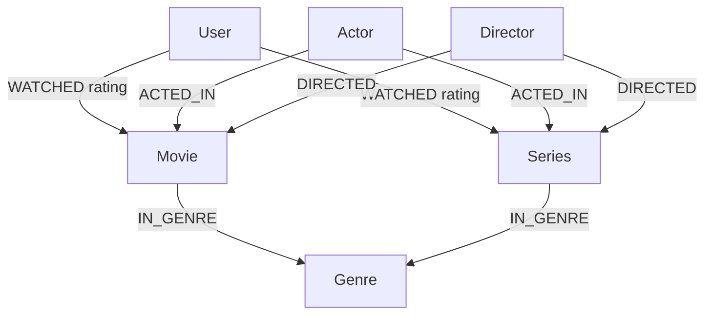

# 🎬 Projeto – Modelagem de Dados em Grafos para Serviço de Streaming

Este projeto apresenta a modelagem e implementação de um **grafo de conhecimento** para um serviço de streaming de filmes e séries, utilizando conceitos de **banco de dados orientado a grafos** (ex: Neo4j).

O foco principal está nos **relacionamentos**, permitindo a construção de **sistemas de recomendação inteligentes**, baseados no comportamento dos usuários e nas conexões entre conteúdos, gêneros, atores e diretores.

---

## 🚀 Objetivo do Projeto

Projetar um modelo de dados em grafo capaz de:

* Representar usuários, filmes, séries e profissionais do entretenimento
* Registrar avaliações de usuários
* Facilitar recomendações baseadas em similaridade e conexões

Este projeto é ideal para fins **acadêmicos**, **portfólio profissional** e **demonstração prática** de Graph Databases.

---

## 🧠 Tecnologias e Conceitos Utilizados

* Banco de Dados em Grafo (Neo4j)
* Linguagem **Cypher**
* Modelagem de Grafos
* Sistemas de Recomendação
* Knowledge Graph

---

## 🧩 Modelo de Dados

### 📌 Nós (Entidades)

* `User`
* `Movie`
* `Series`
* `Genre`
* `Actor`
* `Director`

### 🔗 Relacionamentos

| Relacionamento | Origem → Destino          | Propriedades |
| -------------- | ------------------------- | ------------ |
| `WATCHED`      | User → Movie / Series     | `rating`     |
| `ACTED_IN`     | Actor → Movie / Series    | —            |
| `DIRECTED`     | Director → Movie / Series | —            |
| `IN_GENRE`     | Movie / Series → Genre    | —            |

---

## 🗺️ Diagrama Visual do Grafo



---

## 📂 Estrutura do Repositório

```text
📦 graph-streaming-model
 ┣ 📄 README.md
 ┣ 📄 streaming_graph.cypher
```

* `streaming_graph.cypher`: Script responsável por criar constraints e popular o banco de dados

---

## ⚙️ Funcionalidades Possíveis

Com esse modelo, é possível responder perguntas como:

* 🎯 Quais filmes recomendar para usuários que gostam de Sci‑Fi?
* 🎯 Usuários que assistiram *Matrix* também assistiram quais conteúdos?
* 🎯 Quais atores aparecem em conteúdos mais bem avaliados?
* 🎯 Quais diretores são mais populares entre usuários com nota média alta?

---

## 📈 Possíveis Expansões

* Algoritmos de recomendação (similaridade de usuários)
* Adição de relacionamento `FAVORITE`
* Integração com APIs
* Visualização avançada no Neo4j Bloom

---

## 👨‍💻 Autor

Projeto desenvolvido para fins educacionais e de portfólio.

Se você gostou deste projeto, ⭐ o repositório e fique à vontade para contribuir!
